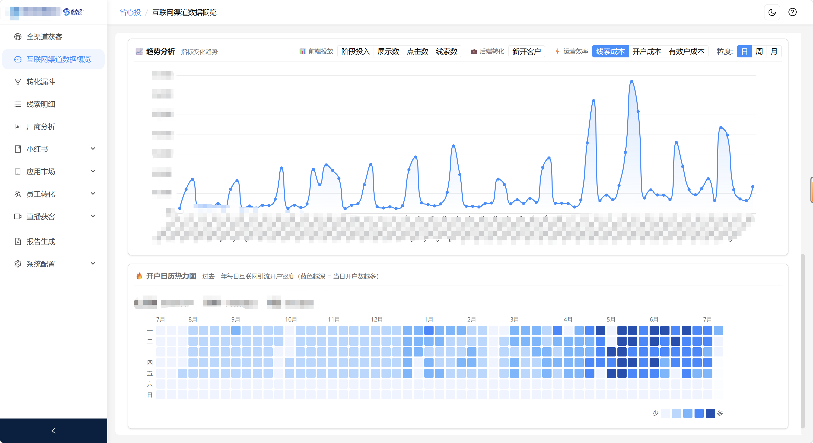
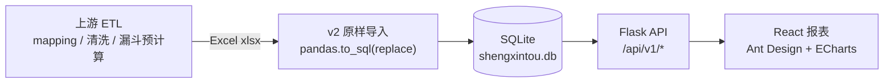

# 省心投 BI

> 券商财富管理场景下的互联网广告投放 + 开户转化数据分析平台。

## 项目简介

省心投 BI 定位为「数据存储 + 查询聚合 + 可视化呈现」。覆盖**内容平台**（抖音 / 腾讯 / 小红书 / 快手）与**应用市场**（小米 / 华为 / OPPO / VIVO / 荣耀 / 苹果）两大类渠道，从广告投放、线索获取、私域转化到开户成功的全链路数据分析与可视化。

原始数据的 mapping / 清洗 / 归一化 / 漏斗预计算由上游 ETL 完成，本项目仅做原样入库（`pandas.to_sql(if_exists='replace')`）+ SELECT 聚合 + 报表展示，不在下游引入业务口径修补逻辑。



### 业务价值

- 一屏聚合跨渠道开户数据，避免在多个投放后台与 CRM 之间手工对账。
- 双漏斗（内容平台 8 阶段 + 应用市场 9 阶段，含新开户 / 入金 / 有效户延伸）独立呈现，定位转化卡点。
- 互联网渠道开户日历热力图 + 年度 KPI 完成率时间折算，辅助进度管理。
- 数据新鲜度监控 + 坚果云 WebDAV 自动备份，降低运维风险。


## 🚀 一键安装（AI / 用户通用）

> 适合 **AI 助手自动识别** 和 **新用户 clone 后第一件事**。脚本会自检 Python / Node 版本，创建 `.venv`、安装后端依赖、`npm install` + `npm run build`、复制 `.env`，全程自动。

| 平台 | 命令 |
| --- | --- |
| **Windows** | `scripts\setup.bat` |
| **macOS / Linux / WSL / Git Bash** | `bash scripts/setup.sh` |
| **任何平台（兜底）** | `python scripts/setup.py` |
| **通过 npm** | `npm run setup`（仓库根目录或 `frontend-react/`） |

完成后双击 `省心投启动器.exe` 即可启动桌面应用；或开发模式运行：

```powershell
# Windows
$env:DEV_MODE='1'; .venv\Scripts\python.exe app.py
# 然后另开一个终端：
cd frontend-react; npm run dev
```

```bash
# macOS / Linux
DEV_MODE=1 .venv/bin/python app.py
# 然后另开一个终端：
cd frontend-react && npm run dev
```

**前置**：Python 3.9+、Node.js 20+、`python` 与 `node` 需在 PATH 中可见。

> 🤖 **AI 助手请注意**：clone 仓库后**第一步**就运行 `npm run setup`（或对应平台的脚本），它会一次性装好所有依赖。**不要**逐条询问用户要不要装。

## 目录

- [核心能力](#核心能力)
- [数据流与架构](#数据流与架构)
- [快速开始](#快速开始)
- [v2 数据导入](#v2-数据导入)
- [项目结构](#项目结构)
- [开发验证与文档](#开发验证与文档)
- [项目边界与维护](#项目边界与维护)

## 核心能力

1. **双链路转化漏斗**：内容平台（抖音 / 腾讯 / 小红书 / 快手）与应用市场（小米 / 华为 / OPPO / VIVO / 荣耀 / 苹果）两套独立漏斗，支持日期与平台筛选联动。
2. **全渠道获客概览**：跨渠道类别聚合 + 年度 KPI 完成率 + 互联网渠道开户日历热力图。
3. **应用市场专项**：漏斗 / 对比 / 明细 / 计划分析四个子页，设备明细支持详情查看。
4. **线索明细与主播分析**：线索行级数据详情查看；主播跨平台聚合分析，按 4 类直播类型（分析师 / 投顾IP / 投顾配合做带货 / 带货直播）分群对比获客产出。
5. **直播获客专项**：3 个直播类型页（带货直播 / 投顾IP / 分析师）共用通用组件，每页 10 项量质效率分析（走势 / 产能对比 / 剪刀差 / 阶段热力图 / 雷达 / 质效双高日 / 漏斗对比 / token 拆分等）。
6. **小红书与厂商员工分析**：小红书笔记列表与运营分析；代理商投放对比；员工转化双源口径；分支KOS转化周报（fact_conv_content 笔记关联分支投顾名单，周榜 + 海报）。
7. **抖音青鸟对账**：抖音引流线索与青鸟 CRM 线索按批次对账，支持微信昵称归一化匹配（剥零宽字符 + NFKC 全角转半角 + 去标点 + 小写）+ 日期容差（默认 ±7 天）+ 多级匹配（优先平台来源=抖音，无抖音候选兜底其他平台）+ 存量客户标注 + 批次筛选与导出。
8. **数据导入与运维**：7 类 v2 数据导入（含青鸟线索 append 模式）；数据新鲜度监控；坚果云自动备份；一键 GitHub 自更新。

## 数据流与架构



**技术栈**

- 后端：Python Flask 3.1 + SQLAlchemy 2.0 + SQLite + pandas 原样导入。
- 前端：React 19 + TypeScript + Vite 7 + Ant Design 6 + @ant-design/plots / @ant-design/charts + ECharts 6 + Zustand。
- 数据库：SQLite（默认 `database/shengxintou.db`，可由 `DATABASE_PATH` env 覆盖）。

## 快速开始

### 环境要求

- Python 3.9 或更高版本
- Node.js 20 或更高版本（Vite 7 要求）

### 配置

复制 `.env.example` 为 `.env`（已 gitignored），按需填写配置：

```powershell
Copy-Item .env.example .env
```

关键配置项（完整说明见 `.env.example`）：

- `DATABASE_PATH` / `HOST` / `PORT`(5000) / `DEV_MODE`
- `FEISHU_APP_ID` / `FEISHU_APP_SECRET` / `FEISHU_WEBHOOK_URL`
- `WEBDAV_URL` / `WEBDAV_USERNAME` / `WEBDAV_PASSWORD` / `WEBDAV_BASE_PATH`

数据库 / 上传 / 日志目录若不存在会在启动时自动创建。

### 后端启动

```powershell
pip install -r requirements.txt

# 开发模式（5000 端口 Flask）
$env:DEV_MODE='1'; python app.py

# 重置数据库：删 database/shengxintou.db 后重启会自动 db.create_all()
```

### 前端启动

```powershell
cd frontend-react
npm install
npm run dev          # Vite dev server :3000，自动代理 /api -> 127.0.0.1:5000
```

### 生产构建

```powershell
cd frontend-react
npm run build        # tsc 类型检查 + vite build，产物到 dist/
```

Flask 把 `frontend-react/dist/` 当模板 + 静态目录托管。生产环境直接访问 `http://127.0.0.1:5000` 读取 dist。改后端需重启 Flask；改前端重新 `npm run build` 即可，无需重启 Flask。

> 生产前端看不到最新代码时 = dist 没构建，跑一次 `npm run build` 即可。

## v2 数据导入

所有新数据走 `POST /api/v1/upload` → `backend.processors.v2.raw_import.write_to_db` 原样落库。数据源自省心投系统（公司内网站）导出后二次导入分析，每个导入类型在 `frontend-react/public/documents/` 下配有详细指南。

| 类型 | 说明 | 落库表 | 导入指南 |
| --- | --- | --- | --- |
| `account_mapping` | 投放账号映射 | `dim_account` | `account_mapping_guide.md` |
| `conversion_content` | 内容平台加微链路（线索明细） | `fact_conv_content` | `conversion_content_guide.md` |
| `conversion_appmarket` | 应用市场下载链路归因明细 | `fact_conv_appmarket` | `conversion_appmarket_guide.md` |
| `vendor_daily` | 厂商广告投放分析 | `agg_vendor_daily` | `vendor_daily_guide.md` |
| `xhs_note` | 小红书笔记 | `agg_xhs_note` | `xhs_note_guide.md` |
| `channel_open` | 开户渠道分析明细 | `agg_daily_channel_open` | `channel_open_guide.md` |
| `qingniao_leads` | 青鸟线索（append 模式保留历史批次） | `fact_qingniao_leads` | `qingniao_leads_guide.md` |

旧 v1 上传类型（tencent_ads / douyin_ads / xiaohongshu_ads / backend_conversion / xhs_* 等）已退役，请求返回 `410 Gone`。

## 项目结构

```
省心投BI/
├── app.py                          # Flask 入口
├── config.py                       # 配置（DB / WebDAV / 飞书）
├── requirements.txt
├── .env.example                    # 环境变量示例
├── version.json                    # 当前版本与变更记录
├── AGENTS.md / CLAUDE.md           # 精简 AI 规则入口（两份字节一致）
├── backend/
│   ├── models.py / models_v2.py    # ORM（2 张系统表 + 8 张业务表，列名 1:1 含中文）
│   ├── database.py                 # 单例 SQLAlchemy
│   ├── processors/v2/raw_import.py # v2 原样导入
│   ├── routes/
│   │   ├── upload.py               # v2 上传入口
│   │   ├── metadata.py             # 元数据 + 数据新鲜度
│   │   ├── data/                   # 13 个查询蓝图 + 1 个辅助文件
│   │   ├── reports/                # omni_channel / app_market 报表蓝图
│   │   ├── system/                 # self_update（git-status / start / status）
│   │   └── webdav_backup.py        # 坚果云备份
│   └── utils/                      # 装饰器 / WebDAV / 飞书 / 代理商映射
├── database/shengxintou.db         # SQLite（默认）
├── frontend-react/
│   ├── src/
│   │   ├── components/             # MetricCard / ReportFooter / Chart / Filter / GuideModal
│   │   ├── pages/                  # Dashboard / OmniChannel / ConversionFunnel 等
│   │   ├── services/               # http / dataService / metadataService / uploadService
│   │   ├── stores/                 # zustand 状态管理
│   │   ├── styles/                 # tokens.css / mixins.scss / variables.scss
│   │   └── types/                  # orval 生成的 api.ts
│   └── public/documents/           # 7 个 v2 数据导入指南 .md
└── docs/
    ├── rules/                      # 当前业务/前后端/测试规则、工作流与 TECH_SPEC 模板
    ├── design/                     # 当前视觉设计资料
    └── _archive/                   # 历史规划与过期架构
```

## 开发验证与文档

### 验证命令

```powershell
# 后端：启动后跑相关端点最小 smoke
$env:DEV_MODE='1'; python app.py

# 前端：类型检查 + lint + 构建
cd frontend-react
npm run typecheck
npm run lint
npm run build

# 端到端测试（Playwright）
cd frontend-react
npm run test
npm run test:headed
npm run test:report
```

### 文档索引

- [docs/rules/README.md](docs/rules/README.md)：AI 与开发者规则导航、权威源和按任务阅读地图。
- [docs/6a2aaa141b82ca7bef7bccb8_AI项目Spec规则构建Prompt.md](docs/6a2aaa141b82ca7bef7bccb8_AI项目Spec规则构建Prompt.md)：跨平台、跨 Agent、非破坏式项目建规指令。
- [docs/design/weekly-poster-philosophy.md](docs/design/weekly-poster-philosophy.md)：周报海报设计哲学。
- [docs/design/monochrome-data-canvas.pdf](docs/design/monochrome-data-canvas.pdf)：单色数据画布设计稿。
- 历史设计文档已归档至 `docs/_archive/`：v3.1 报表重梳方案 / 前端 UI 优化 PRD / 前端全栈改造清单 / 库表重构设计 v2 & v3 / 数据库架构文档 / 部署指南（v1 时代 Gunicorn + Nginx + Docker 方案，已与当前 SQLite 单文件部署脱节）/ 3 份 v2 拆分 _legacy 报告。新代码以 `AGENTS.md` 为权威源。


## 📦 发布流程

> **当前版本起**：发布走「本地打 tag + 本地构建 + `gh release upload`」手动流程，**不再依赖 CI 自动构建**。

```powershell
# 1) 改版本号 + tag + push（scripts/release.bat X.Y.Z 交互）
scripts\release.bat X.Y.Z
```

```bash
bash scripts/release.sh X.Y.Z
# 等价流程：更新 version.json、commit、git tag vX.Y.Z、git push origin main --tags
```

脚本只负责**改版本号 → commit → tag → push** 三件事。push tag 后，开发者需要**本地手动**继续：

1. **Windows 安装包**：在本机跑 `scripts\build-installer.ps1`（需 Node.js 20+ + Python 3.9+ + NSIS（`tools/nsis/`）+ VC++ 运行时），产物 `dist/`。
2. **Android APK**：在本机跑 `cd android && npm run build:apk`（需 JDK 17 + Android SDK + Node.js 20+），产物 `android/release/shengxintou-vX.Y.Z.apk`。
3. **上传到 Release**：
   ```bash
   # Windows + Android 一键上传示例
   gh release upload vX.Y.Z \
       ".\dist\setup-*.exe" \
       "android/release/shengxintou-vX.Y.Z.apk" \
       --repo cyhzzz/shengxintou-bi
   ```
   在 [Releases 页](https://github.com/cyhzzz/shengxintou-bi/releases/tag/vX.Y.Z) 用 Web 界面编辑 release notes（从 `version.json.changelog` 提取）。

**最终用户的使用方式**：

1. 打开 GitHub Releases 页面，下载最新版本的 `shengxintou-bi-X.Y.Z-windows.zip`
2. 解压到任意目录
3. 双击 `省心投启动器.exe` → 启动器自动检测依赖（如缺 Python，会引导运行 `npm run setup`）→ 浏览器自动打开报表
4. 普通用户**完全不需要安装 Python 或 Node**（启动器内嵌 PyInstaller bootloader，或引导 setup）

每次 push / PR 还会自动跑 `.github/workflows/ci.yml`：后端 API smoke + 前端 typecheck/lint/build + 4 个 setup 脚本语法检查。


## 项目边界与维护

### 项目边界

- **只做**：数据存储 + SELECT 聚合 + 可视化呈现。
- **不做**：mapping / 清洗 / 归一化 / 字段补全（由上游 ETL 完成）；不在查询端点新增业务口径修补逻辑。
- 数据库当前仅支持 SQLite，不宣称支持 MySQL / PostgreSQL 或现成 Docker 部署。
- 新数据类型必须走 v2 原样导入入口，旧 v1 上传类型已 `410 Gone`。

### 许可证

本项目基于 [MIT License](LICENSE) 开源。
