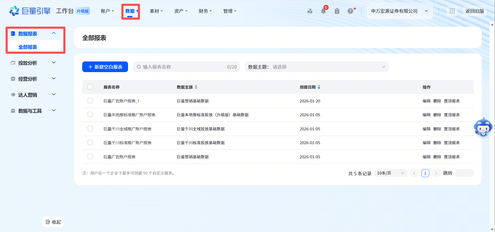

# 抖音广告数据导入指南

## 📋 数据说明

**数据类型**: 抖音广告投放数据
**数据级别**: 账号级别
**导入格式**: .xlsx, .xls, .csv
**数据来源**: [巨量引擎广告投放平台](https://www.oceanengine.com/)

---

## 🔍 如何获取数据

### 步骤 1: 登录巨量引擎投放平台

1. 访问 [https://www.oceanengine.com/](https://www.oceanengine.com/)
2. 使用您的账号登录

### 步骤 2: 进入报表中心

1. 点击顶部导航菜单的 **"数据"** 
2. 选择左侧 **"数据报表"-"全部报表"**

### 步骤 3: 设置数据导出条件

1. **选择报表类型**: 巨量广告账户报表
2. **点击右侧按钮**：展开自定义
3. **选择日期范围**: 选择需要导出的日期范围
4. **选择维度**: 时间-天，账户ID，账户名称
5. **选择指标**: 必须包含以下指标
   - ✓ 消耗（元）
   - ✓ 展示数
   - ✓ 点击数
   - ✓ 转化数

### 步骤 4: 导出数据

1. 点击 **"导出"** 或 **"下载"** 按钮
2. 选择导出格式：**Excel** 或 **CSV**
3. 下载文件到本地

---

## ✅ 数据格式要求

### 必需字段（6个）

| 字段名 | 说明 | 格式要求 | 示例 |
|--------|------|----------|------|
| 日期/时间-天 | 投放日期 | YYYY-MM-DD | 2025-01-15 |
| 账户ID | 广告账户ID | 文本 | 1839699079285836 |
| 消耗/花费 | 投放花费 | 数值，保留2位小数 | 1234.56 |
| 展示数 | 展示次数 | 整数 | 100000 |
| 点击数 | 点击次数 | 整数 | 5000 |
| 转化数 | 转化次数 | 整数 | 100 |

### 字段映射说明

系统支持以下列名变体（自动识别）：

| 标准字段 | 支持的列名 |
|---------|-----------|
| 日期 | 日期, 时间, 时间-天 |
| 账户ID | 账户ID, 账户, 账号, 广告账户ID |
| 花费 | 消耗, 花费, 消费 |
| 展示数 | 展示数（注意：不是"展现数"）, 展现, 展现量, 曝光 |
| 点击数 | 点击数, 点击, 点击量 |
| 转化数 | 转化数, 转化 |

### ⚠️导入模式

- **覆盖模式**: 日期 + 账户ID 相同时，更新已有数据
- **数据去重**: 系统自动处理重复数据，保留最新导入的记录

### 常见问题

**Q: 导入后数据不显示？**
- 检查日期范围是否在筛选范围内
- 确认账号是否有代理商映射（可在账号管理中配置）
- 刷新页面重新加载

**Q: 提示"缺少必需字段"？**
- 确认Excel/CSV文件包含所有必需列
- 检查列名是否正确（注意是"展示数"而非"展现数"）

**Q: 转化数为0或缺失？**
- 转化数据可能在其他报表中，如需完整转化数据请确保导出时包含转化指标
- 转化数可以为0，不影响导入

---

## 📥 导入步骤

1. 在数据导入页面，选择 **"抖音广告"** 数据类型
2. 点击上传区域或拖拽文件到上传框
3. 选择导出的文件（.xlsx, .xls 或 .csv）
4. 确认文件信息无误
5. 点击 **"开始导入"** 按钮
6. 等待导入完成（查看导入进度）
7. 导入完成后，如有代理商新增账号的，前往 **账号管理** 补充账号映射信息

---

## 🔗 后续操作

### 账号映射配置

导入成功后，建议立即配置账号代理商映射：

1. 进入 **配置管理** → **账号管理**
2. 找到新导入的抖音账号
3. 补充以下信息：
   - 账号名称
   - 代理商名称
   - 业务模式（直播/信息流/搜索）
4. 保存配置

### 数据验证

导入完成后，可在以下报表中验证数据：

- **数据概览**: 查看整体花费趋势
- **厂商分析**: 按代理商维度查看抖音数据
- **线索明细**: 查看抖音平台的转化数据

---

## 💡 数据质量建议

### 导入频率建议

- **建议频率**: 每周一次（导入前一天数据）
- **最佳时间**: 上午10点后（平台数据已更新）
- **日期范围**: 建议单次导入不超过31天

### 数据验证建议

导入后请验证：
1. 总花费是否与平台一致
2. 账户数量是否正确
3. 日期范围是否完整

---

## 📞 技术支持

如遇到问题，请联系：
- 技术支持: [邮箱/电话]
- 查看在线文档: [帮助文档链接]

---

**文档更新时间**: 2026-01-28
